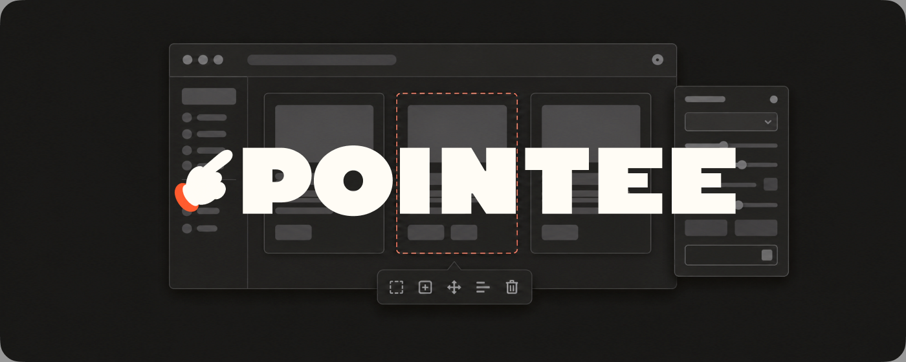

Point at any element. Copy it. Paste it into your coding agent.

**[Install from the Chrome Web Store](https://chromewebstore.google.com/detail/igboajiogegaabhkjehjmdgmfkcopogj)**

Pointee is a Chrome extension for the moment you can see the thing you want changed but
have to describe it. Switch it on, point at the element, and copy a pointer your agent can
act on: where it came from in your source, how to find it in the page, and — if you tuned
it live first — exactly what you changed. It names no agent. Claude Code, Cursor, Codex,
Gemini CLI, Copilot: anything that reads a prompt reads what Pointee copies.

Pointee is the new name of Claude Code Probe. Same extension, same listing, from 2.0.

## What you get

| Action | On the clipboard |
|---|---|
| **Copy Code** | A pointer: source location when your tooling exposes one, page, a unique anchor, selector, position among siblings, whether it is one of a repeated template, its text, and its HTML at the depth you choose |
| **Screenshot** | A PNG of the element alone |
| **Edit** | Opens a panel that tunes the element live — type, spacing, size, fill, border, shadow — and copies the pointer plus a before → after list of what changed |
| **Select Parent** | Moves the selection up one level; click again to keep climbing |
| **Measure** | Hold **Option** (Alt) and point at another element: redlines with the distance across every gap |

## Install

From the store link above, or from source:

```sh
git clone https://github.com/Jingquank/pointee.git
cd pointee
npm install
```

Then `chrome://extensions` → Developer mode → Load unpacked → pick the folder.

## Using it

### Point

Click the toolbar icon to enter Point Mode. Hover, and a dashed outline draws the element's
box model — margin, border and padding bands, with its real corner radii — while the info
label beside it reads out:

- **Identity** — tag, `#id`, classes, and pixel size
- **Text** — the first of the element's own text, when it has any
- **Layout** — display, position, font size and weight, `role`, `aria-label`, child count; only what isn't the default
- **Paint** — background, colour, border, radius, shadow, opacity, cursor, transform, z-index, with a swatch beside each colour
- **Breadcrumb** — the ancestor path, scrolling when it is longer than the label

### Select

Click, and the outline starts to crawl. The four actions appear in the layout you chose in
settings — by default a pill of icons riding the element's bottom edge. The label and the
actions are placed together in one pass, so they stay on screen and off each other for any
element, including ones taller than the window and `<body>` itself.

**Esc** steps back one layer at a time: picker, then panel, then selection, then Point
Mode.

### Copy Code

A pointer, not a description. It says which construct you mean and gets out of the way, so
your own instruction is the loudest thing in the prompt.

````
```
# source: src/components/PlanCard.tsx:42:6
# page: localhost:5173/pricing
# anchor: data-testid="plan-card" (unique in page)
#   text "Pro Plan" (unique in page)
# selector: div[data-testid="plan-card"]
# position: child 2 of 3 in div.grid
#   after div.card "Starter", before div.card "Team"
# repeated: 2 of 3 identical siblings - likely one template; change
#   the component or the data unless this instance alone is meant
# text: Pro Plan For teams that need more. Upgrade
<div class="card flex flex-col gap-3 rounded-xl border p-6 shadow-sm" data-testid="plan-card"> … 3 children </div>
```
````

- **source** is best-effort. It reads the attributes dev tooling already emits —
  `data-inspector-*` (react-dev-inspector), `data-v-inspector` (vite-plugin-vue-inspector),
  `data-source-loc` / `data-source-file`. No plugin, no line.
- **repeated** appears only when the element has identical siblings — the difference
  between editing one card and editing the component that renders all of them.
- The **HTML** is the element's own tag with its children summarised, because with a source
  pointer the agent should read the real JSX rather than a rendered copy. When neither a
  source location nor a component name resolves, the full subtree comes back instead.

Every field can be switched off and three more switched on; the HTML block has four
sizes. See **Copying** under Settings.

### Edit

The pencil opens a panel attached to the element's edge: an inspector column of the
properties worth reaching for. Type a value, arrow it, or drag sideways to scrub, and the
page updates under your hands. The panel follows the element until you drag it away, after
which it floats where you put it with a dashed run tying it back.

**It steps your design tokens, not just pixels.** A heading set to `var(--title-sm)` is
reported as `--title-sm`, and `›` writes `var(--title-lg)` — the indirection your source
has, rather than a pixel count. Utility classes work the same way. Tokens are found by
asking the element what it can see, so a theme scope, a shadow root, an `@import` or a
stylesheet on a CDN all count, and a Tailwind scale in `calc()` or a palette in `oklch()`
is a scale like any other. Colours are named on both sides of the arrow when the source
names them, and left as hex when it doesn't.

Nothing is applied blind. Each edited property gets a dot that takes it back; **⌘Z** walks
one timeline across every element you touched; the reset button puts every element back as
it was found. Edits live in the page until you undo them, reset them, switch off, or
reload. Nothing is written to your files — the copied block is the instruction to make
them real:

```
# source: src/components/SkillCard.tsx
# selector: main > .cards > article.card:first-child
# edits: apply these style changes to this element in the source
#   font-size: --title-sm (18px) → --title-lg (28px)
#   padding-top: 16px → 24px
#   background-color: #ffffff → --terra (#a94f30)
<article class="card">…</article>
```

The before-value is how the agent finds the declaration to change.

Select a canvas while editing and the panel's **Advanced** section lists the shader's
uniforms as live controls.

### Measure

With an element selected, hold **Option** (Alt on Windows and Linux) and point at another.
Redlines appear in the accent: a line across each gap with the distance, dashed guides
where the two boxes don't align, four inset measurements when one contains the other.
Clicking while holding re-anchors, so you can walk a row of siblings without releasing the
key. The label and the actions step aside while the key is down.

## Settings

The gear in the top-right corner opens the settings page. Every section previews itself in
a rail beside it — the real chrome, drawn through the same stylesheet the extension uses.
Changes reach open tabs immediately, without a reload.

| Section | What it controls |
|---|---|
| **Appearance** | Eight themes for Pointee's own chrome. System, the default, follows your OS; Light and Dark are Pointee's own pair; Dracula, Monokai, Nord, Solarized Dark and Tokyo Night map onto the palette roles editor themes define |
| **Selection** | Where the four actions sit: on the element's edge as a pill, beside the readout's lines, under its name, or along its bottom as a labelled bar |
| **Measuring** | How redlines read and draw: px or rem, whole or tenths, where the value pill sits, guides, a quiet overlay, and whether flush edges are marked |
| **Editing** | Whether the panel shows every group it can edit or only the ones the element has, how token values are offered, and deep shader capture for single-frame canvases |
| **Copying** | Which fields ride along in the pointer, how much HTML comes with them, and whether the block is fenced — with a live preview of the payload itself |

Everything is stored on this device with `chrome.storage.local` and never leaves it.

## Privacy

No accounts, no servers, no analytics, no tracking. Nothing about you or the pages you
visit is stored or sent anywhere. The one network request the extension ever makes is for
a stylesheet the page already loaded, while the edit panel is open, so it can name the
tokens that stylesheet defines. [PRIVACY.md](PRIVACY.md) has the whole of it.

## Development

```sh
npm install          # fetches html2canvas-pro into lib/ if it is missing
npm test             # every suite, browser included
npm test -- --fast   # everything except the browser
npm run build        # dist/pointee-chrome.zip, ready for the store
```

Load unpacked from the repo root while you work. Changes to `content.js` or `content.css`
need an extension reload in `chrome://extensions`; reloading the page alone isn't enough.

`content.js` is a classic script — MV3 content scripts cannot be modules — so its pure
functions are transcribed into `test/` and swept there: the placement solver over a
23-case matrix in every selection layout, the redline geometry over ten thousand element
pairs, the tether and the panel's attachment, the token resolver, the colour maths, the
copied block's shape. `test/mirror-drift.mjs` fails the run when a transcription and its
original disagree, and `test/cdp.mjs` drives the real `content.js` in a real browser.
`test/tokens.mjs` keeps the stylesheets honest: no colour literal outside `tokens.css`,
every theme complete, every text tone above WCAG AA on its own surface.

Two pages let you watch the chrome without a rebuild — serve the repo over HTTP and open
`test/harness.html` for placement or `test/edit-harness.html` for Edit Mode.

```sh
node icons/generate-icons.mjs   # icons/ light and dark sets from assets/icon.png
```

The words the code and the docs share are in [CONTEXT.md](CONTEXT.md). The design system —
brand, type, tokens, motion, every surface, and the rules that don't move — is
[DESIGN.md](DESIGN.md); the decisions behind it are in [docs/adr](docs/adr).

## History

Versions 1.0 to 1.5 shipped as Claude Code Probe. The `legacy/claude-code-probe` branch
holds 1.5.0 as it was. 2.0 is the rename: agent-agnostic and unbranded, redrawn from the
tokens up, with every 1.5 feature carried across.

## License

MIT
